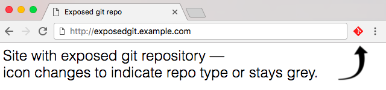

# Repo In The Wild

## About
This browser extension checks for publicly exposed repositories and changes it's icon to the logo of the detected repository type.

Currently supported are:
 * Git
 * Subversion
 * Mercurial

If you detect a website with a publicly exposed repository, please contact the owner of the website. 

For more information about why it's bad to expose a repository like this, go to https://en.internetwache.org/dont-publicly-expose-git-or-how-we-downloaded-your-websites-sourcecode-an-analysis-of-alexas-1m-28-07-2015/

